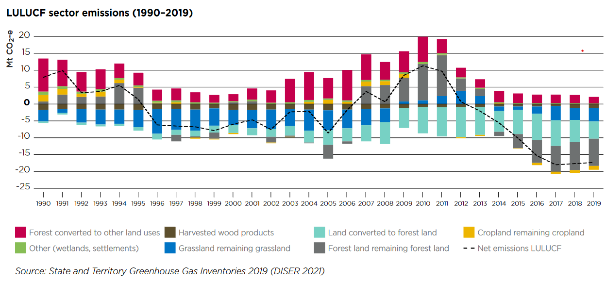
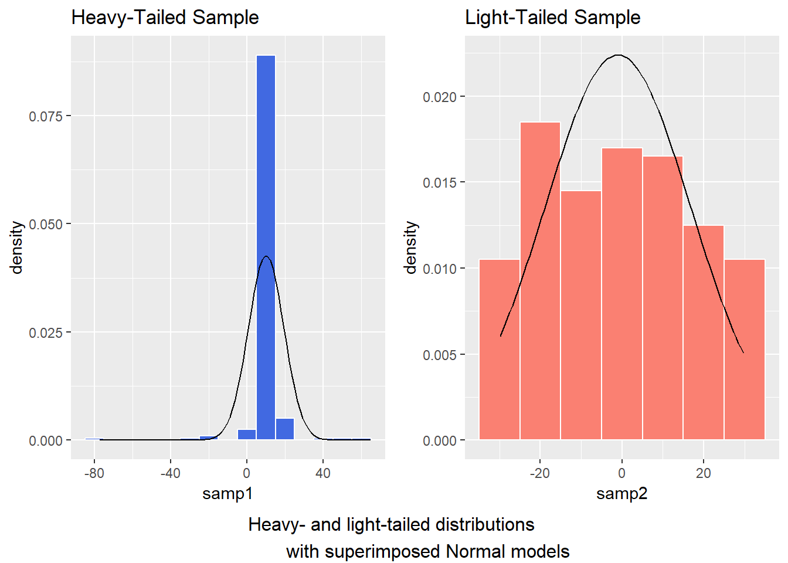

```{r setup, include=FALSE}
# Use this chunk to quietly load your packages

knitr::opts_chunk$set(
	fig.align = "center",
	message = FALSE,
	warning = FALSE
)
# Packages loaded in this chunk will not appear in the presentation. 

library(ggplot2) # Useful for creating plots
library(dplyr)  # Useful for data manipulation
library(tidyr)
library(tibble)
library(knitr) # Useful for creating nice tables
library(readxl)
library(lubridate)
library(ggplot2)
library(ggrepel)

```

## Introduction 

- Australia has been investing in renewable energy increasingly after ratifying the NFCCC’s Kyoto Protocol in 2007.
- Under it's first commitment (2008-2012), it set a target of not exceeding 108% of it's greenhouse gas emissions in 1990. 
- It's Second commitment to the Kyoto Protocol (2013 -2020), set a target of 99.% of 1990 levels.

Australia under these protocols has met and exceeded it's targets as the nation moves to reduce the greenhouse gas emissions and overall it's contribution to global warming.  

<div style="display: flex; align-items: center;">
  
  <blockquote style="margin: 0; font-size: 16px;">
    "Today I have signed the instrument of ratification of the Kyoto Protocol. This is the first official act of the new Australian Government, demonstrating my Government’s commitment to tackling climate change." - Kevin Rudd, 2007
  </blockquote>
</div>

<div style="position: absolute; bottom: 10px;">
Ref: What is the Kyoto Protocol? | UNFCCC (2020), Rudd Government Ratifies Kyoto Protocol (2007)
</div>

## Introduction Cont.

- Since initial commitments to reduce the greenhouse gas emissions Australia also signed the 2015 Paris Agreement which countries globally agreed to hold the increase in global average temperature to below 2°C and aim to keep them at less than 1.5°C. 

- Initial emissions targets we signed committed to a reduction of 26-28% of 2005 levels by 2030

- In 2022, nations met again and Australia increased it's reductions target to a reduction of 43% by 2030 under the *Climate Change Act (2022)*.

- This was in response to slow initial targets and to commit to The Net Zero Plan for 2050. Where Austrlia aims to have a net 0 greenhouse gas emissions. 

<div style="display: flex; align-items: center;">
  
  <blockquote style="margin: 0; font-size: 16px;">
    Anthony Albanese has signed a commitment to the United Nations that Australia will reduce its emissions by 43 per cent by 2030. (ABC News: Andrew Kennedy)
  </blockquote>
</div>

<div style="position: absolute; bottom: 10px;">
Ref: International Climate Action - DCCEEW, ABC News (2022)

</div>

## Problem Statement

With Australia's continued promise to reduce greenhouse gas emissions the question is:

<b>Will Australia meet its 2030 greenhouse gas emissions targets?</b>  

We can analyse this by the following:

- Find and report on the greenhouse gas emissions Australia has measured since they started recording them. 
- Understand what changes are being made to reduce this number
- Create a linear regression model to predict the greenhouse gas emissions by 2030
- Use Hypothesis testing to test the validity of the model and the prediction
- Discuss the findings of the model and the data

## Data

<!-- - You can use multiple slides to break up your sections.  -->
<!-- - Explain how you collected your data. -->
<!-- - There should be enough detail here so that someone else could replicate your data collection. -->
<!-- - Explain the sampling method if known -->
<!-- - Ensure you reference the data source if you have used Open Data -->

Two data sources were used to investigate this question. 

1. National Greenhouse Gas Inventory Quarterly Update: September 2023

- A quarterly report on Australia's greenhouse gas emissions featuring data going back to 2004.
- This data features the emissions produced by each industry and reports the national inventory total.
- The data reported features it's actual value, a seasonally adjusted value as well as a rolling trend.

2. Energy Account, Australia: 2021-22 financial year 
- A yearly report on the supply and use of energy particularly by different sources. 
- The data was given in Petajoules (PJ) and shows the energy output of different methods of energy production and how much each industry uses.  


<div style="position: absolute; bottom: 10px;">
Ref: International Climate Action - DCCEEW, Australian Bureau of Statistics (ABS)
</div>

```{r, echo=FALSE}
# Import Data from 2022 Energy Account
Energy_Account_2022 <- read_excel("46040DO0001_2021_22.xlsx", 
    sheet = "Data", range = "A6:AM27")

# Transpose Data frame
Energy_Account_2022t <- t(Energy_Account_2022)
# Convert back to data frame and add variable headings.
Energy_Account_2022 <- as.data.frame(Energy_Account_2022t[-1,])
colnames(Energy_Account_2022) <- Energy_Account_2022t[1,]

# Remove unneeded variables  
Energy_Account_2022 <- Energy_Account_2022 %>% select(-`Series Start`,-`Series End`,-`Series Type`,-`Data Type`,-Frequency,-`Collection Month`,-`No. Obs`,-`Data Item`)
rm(Energy_Account_2022t)

# Convert to numeric
Energy_Account_2022[-1] <- lapply(Energy_Account_2022[-1], as.numeric)
Energy_Account_2022 <- Energy_Account_2022 %>%
  rownames_to_column(var = "Measurement")

# pivot_longer
Energy_Account_2022 <- Energy_Account_2022 %>%
  pivot_longer(
    cols = c(3:14),  # Replace with the actual indices of your columns
    names_to = "Year",
    values_to = "Value"
  )

# Convert data to date variable
Energy_Account_2022$Year <- as.numeric(Energy_Account_2022$Year)
Energy_Account_2022$Year <- as.Date(Energy_Account_2022$Year, origin = "1899-12-30")

```

<!-- Read data from the National Greenhouse Gas Inventory Quarterly Update Sept 23 -->

```{r, echo=FALSE}
# Define the function to import data.
process_excel_table <- function(file_path, sheet_name, range, date_origin = "1899-12-30") {
  
  # Read the Excel file
  data_table <- read_excel(file_path, 
                           sheet = sheet_name, 
                           range = range, 
                           col_names = FALSE)
  
  # Format variable names
  data_table[1, 3:6] <- data_table[2, 3:6]
  
  # Remove the second row
  data_table <- data_table[-2,]
  
  # Set first row as column names
  colnames(data_table) <- data_table[1,]
  
  # Remove the first row
  data_table <- data_table[-1,]
  
  # Convert variables to numeric (except the first column, assuming it's not numeric)
  data_table <- data_table %>% 
    mutate(across(2:ncol(data_table), as.numeric))
  
  # Convert the Quarter column to date
  data_table$Quarter <- as.Date(data_table$Quarter, origin = date_origin)
  
  # Use the Year from Quarter to fill in the Year variable
  data_table$Year <- year(data_table$Quarter)
  
  return(data_table)
}

NGGI_Actual <- process_excel_table("nggi-quarterly-update-sept-2023-data-sources.xlsx", 
                                   "Data Table 1A", "A5:K84")
NGGI_Season <- process_excel_table("nggi-quarterly-update-sept-2023-data-sources.xlsx",
                                   "Data Table 1B", "A5:K84")
NGGI_Trend  <- process_excel_table("nggi-quarterly-update-sept-2023-data-sources.xlsx",
                                   "Data Table 1C", "A5:K84")

```

## Data Cont.

- Important Variables:

1. The National Greenhouse Gas Inventory (NGGI) features the the date of each quarterly report, the industry, the emissions of that industry and the national inventory total for that quarter. Each value for the emissions was given in million metric tonnes of CO2 equivalent (Mt CO2-e).
2. The 2022 Energy Account had many variables including the metric it was recording, the unit the metric was in, the date and of course value for that year. 

- Data processing: 

Each data set was imported from an excel file specifying the range of values within a table. These tables were then transposed, had data converted and appropriate variable names given from data within the table. 

The data was then cleaned of unneeded variables and tidied using pivot_longer() to adjust the data frame for better use when grouping different industries later. 


## Descriptive Statistics and Visualisation

<!-- - Summarise the important variables in your investigation. -->
<!-- - Use visualisation to highlight interesting features of the data and tell the overall story. -->
<!-- - Explain how you dealt with data issues (if any), e.g. missing data and outliers. -->

1. National Greenhouse Gas Inventory (2023)

"Emissions in the year to September 2023 were 25.4% below emissions in the year to June 2005 (the baseline year for Australia’s 2030 target under the Paris Agreement)." DCCEEW (2024)

```{r, echo=FALSE}
# Retrieve the emissions value for the quarter 2005-06-01
emissions_2005_Total <- NGGI_Season %>%
  filter(Quarter == as.Date("2005-06-01")) %>%
  select(`National Inventory Total`) %>%
  pull()  # This will return a single value
target_level <- emissions_2005_Total * (1 - 0.43)  # Calculate target level (43% below 2005)


total_emissions <- ggplot() +
  geom_line(data = NGGI_Actual, aes(x = Quarter, y = `National Inventory Total`, color = "Actual"), size = 1.2, alpha = 0.5) +
  geom_line(data = NGGI_Season, aes(x = Quarter, y = `National Inventory Total`, color = "Seasonally Adjusted"), size = 1.2, alpha = 0.5) +
  geom_line(data = NGGI_Trend, aes(x = Quarter, y = `National Inventory Total`, color = "Trend"), size = 1.2, linetype = "dotted", alpha = 0.8) +
  geom_hline(yintercept = target_level, linetype = "dashed", color = "red") +  # Add the target line
  annotate("text", x = as.Date("2030-01-01"), y = target_level, label = "2030 target", 
           vjust = 1.5, hjust = 1, color = "red") +  # Add label
  labs(x = "Year", y = "Emissions (Mt CO2-e)", title = "Total Emissions by Year (September 2004 to September 2023)", color = "Legend") +
  scale_color_manual(values = c("Actual" = "#1f78b4", "Seasonally Adjusted" = "#33a02c", "Trend" = "#e31a1c")) +
  scale_y_continuous(limits = c(0, 180)) +  # Set fixed limits for y-axis (adjust as necessary)
  theme_minimal()+
  theme(plot.title = element_text(size = 10, face = "bold"),
        legend.position = "top")

total_emissions
```

## Descriptive Statistics and Visualisation cont 

- <span style="font-size: 14px;">This data set also features data about the emissions produced by each industry and looking at these figures gives us a much better understanding of where the reduction in greenhouse gas emissions primarily come from.
- <span style="font-size: 14px;">There has been a reduction in electricity emissions but the greatest decrease is in Land use change and forestry. As we can see the sector can actually have negative greenhouse gas emissions (sequestration) if greater amounts of land is used for forests and vegetation. 


```{r,echo=FALSE,fig.width=8, fig.height=4}
# Reshape the NGGI_Season data to long format
NGGI_Season_long <- NGGI_Season %>%
  pivot_longer(cols = c(Electricity, `Stationary Energy excl. electricity`, Transport, 
                        `Fugitive Emissions`, `Industrial Processes and Product Use`, 
                        Agriculture, Waste, 
                        `Land Use, Land Use Change and Forestry (LULUCF)`),
               names_to = "Industry",
               values_to = "Emissions")

# Using the last value of Emissions for each Industry
labels <- NGGI_Season_long %>%
  group_by(Industry) %>%
  summarise(Emissions = last(Emissions), 
            Quarter = last(Quarter),  # Capture the corresponding Quarter
            .groups = 'drop')  # Drop grouping

# Create the plot without a legend
industry_emissions <- ggplot(data = NGGI_Season_long, aes(x = Quarter, y = Emissions, color = Industry)) +
  geom_line(size = 1.2, alpha = 0.8) +
  labs(x = "Year", y = "Emissions (Mt CO2-e)", title = "Seasonally Adjusted Emissions by Industry and Year (September 2004 to September 2023)") +
  theme_minimal() +
  theme(plot.title = element_text(size = 10, face = "bold"))+
  theme(legend.position = "none") +  # Remove the legend
  geom_text_repel(data = labels, aes(x = Quarter, y = Emissions, label = Industry), 
                  hjust = 0.5, vjust = -0.5, size = 3) +  # Using ggrepel for better label placement
  theme(panel.grid.minor.x = element_blank())
  

# Display the plot
industry_emissions
```


## Descriptive Statistics and Visualisation cont

2.Energy Account, Australia (2022)

- Renewable energy increased by 19% between 2021 and 2022 fiscal years and now makes up 30% of domestic electricity use. This is where we can see a reductions in emissions in electricity. 

- Solar increased by 25% (125PJ), Wind by 17% (105PJ) and Hydro by 12% (61PJ).
```{r, echo=FALSE, fig.width=10, fig.height=4, fig.align='left'}
library(patchwork)

Energy_Account_2022_renewable <- Energy_Account_2022 %>%
  filter(Measurement %in% c("Renewable sources - hydro energy",
                            "Renewable sources - solar energy",
                            "Renewable sources - wind energy",
                            "Renewable energy supply proportion of total domestic electricity use")) %>%
         mutate(Measurement_clean = case_when(
    Measurement == "Renewable sources - hydro energy" ~ "Hydro Energy",
    Measurement == "Renewable sources - solar energy" ~ "Solar Energy",
    Measurement == "Renewable sources - wind energy" ~ "Wind Energy",
    Measurement == "Renewable energy supply proportion of total domestic electricity use" ~ "Renewable Supply Proportion"
  ))

# Create separate datasets for the different measurements
energy_sources <- Energy_Account_2022_renewable %>%
  filter(Measurement_clean != "Renewable Supply Proportion")

supply_proportion <- Energy_Account_2022_renewable %>%
  filter(Measurement_clean == "Renewable Supply Proportion")

# Using the last value of Emissions for each Industry
labels <- energy_sources %>%
  group_by(Measurement_clean) %>%
  summarise(Value = last(Value), 
            Year = last(Year), 
            .groups = 'drop')  

energy_use <- ggplot(data = energy_sources, aes(x = Year, y = Value, color = Measurement_clean)) +
  geom_line(linewidth = 1.2) +
  labs(x = "Year", y = "Renewable Energy output (PJ)", title = "Renewable Energy by source (2011-2022)", color = "Legend") +
  theme_minimal() +
  theme(plot.title = element_text(size = 10, face = "bold"))+
  theme(legend.position = "none") +  # Remove the legend
  geom_text_repel(data = labels, aes(x = Year, y = Value, label = Measurement_clean), 
                  hjust = 0.5, vjust = 0.7, size = 3.5) + # Using ggrepel for better label placement
  theme(panel.grid.minor.x = element_blank())

energy_proportion <- ggplot(supply_proportion, aes(x = Year, y = Value)) +
  geom_bar(stat = "identity", fill = "lightgreen") +
  labs(x = "Year", y = "Renewable Supply Proportion (%)", title = "Renewable energy supply proportion (2011-2022)") +
  theme_minimal() +
  theme(plot.title = element_text(size = 10, face = "bold"))

# Arrange the two plots side by side
energy_use + energy_proportion + plot_layout(ncol = 2)
```


## Decsriptive Statistics Cont.

Here we can see some statistics about the emissions by each industry.

```{r, echo=FALSE}
# Calculate extra descriptive stats
emissions_2005 <- NGGI_Season_long %>%
  filter(Quarter == as.Date("2005-06-01")) %>%
  select(Industry,Emissions)

emissions_2023 <- NGGI_Season_long %>%
  filter(Quarter == as.Date("2023-06-01")) %>%
  select(Industry,Emissions)

emissions_diff <- left_join(emissions_2005, emissions_2023, by = "Industry", suffix = c(".2005", ".2023"))
emissions_diff <- emissions_diff %>% mutate(Percent_Change = ((Emissions.2023 - Emissions.2005)/Emissions.2005) *100)
#remove placeholder data frames
rm(emissions_2005,emissions_2023)

# Calculate descriptive statistics by industry
descriptive_stats <- NGGI_Season_long %>%
  group_by(Industry) %>%
  summarise(
    Mean = round(mean(Emissions, na.rm = TRUE),2),
    SD = round(sd(Emissions, na.rm = TRUE),2),
    variance = round(var(Emissions, na.rm = TRUE),2),
    n = n(),
    .groups = 'drop'
  ) 

#Join data frames together
descriptive_stats <- left_join(descriptive_stats, emissions_diff, by = "Industry")

# Round all the values to 2 dp for table formatting.
descriptive_stats <- descriptive_stats %>%
  mutate(across(where(is.numeric), ~ round(.x, 2)))

# Format the table for better display
descriptive_stats <- descriptive_stats %>%
  rename(
    `Industry` = Industry,
    `Mean Emissions` = Mean,
    `Standard Deviation` = SD,
    `Variance` = variance,
    `Sample Size (n)` = n,
    `2005 Emissions` = Emissions.2005,
    `2023 Emissions` = Emissions.2023,
    `Percent Change (%)` = Percent_Change
  )

# Format the table for display
kable(descriptive_stats)

```

## Regression analysis
- <font size="2">A linear regression model was used on the NGGI data to predict what future emissions could look like in 2030 and beyond.</font> 
- <font size="2">A Residuals vs Fitted and a Q-Q plot was used to check the assumption of homoscedasticity and normality. Larger deviations from the model can be attributed to early data before the inflection point in reducing greenhouse gas emissions.</font>
- <font size="2">The Q-Q plot also shows an S-shaped curve which will be discussed later.</font>

```{r, echo=FALSE, fig.width=8, fig.height=4}
# Fit the linear regression model
linear_model <- lm(`National Inventory Total` ~ Quarter, data= NGGI_Season_long )

# Set up the plotting area to have 1 row and 2 columns
par(mfrow = c(1, 2))

# Plot residuals
plot(linear_model, which = 1) 

# Base R QQ plot
qqnorm(NGGI_Season_long$`National Inventory Total`, main = "QQ Plot for Emissions Total")
qqline(NGGI_Season_long$`National Inventory Total`, col = "red")

# Reset the plotting layout
par(mfrow = c(1, 1))
```

## Regression analysis cont
As we can see at Australia's current rate we will narrowly miss the emissions target and even more worryingly if we extrapolate this out to 2050 we aren't close to meeting the target of net zero emissions.

```{r, echo=FALSE, fig.width=5, fig.height=4}
# Create a sequence of quarterly dates from 2023-12-01 to 2030-06-01
quarter_dates <- seq(as.Date("2023-12-01"), as.Date("2030-06-01"), by = "quarter")

# Create a data frame with these numeric years
future_data_total <- data.frame(Quarter = quarter_dates)

# Predict emissions for the future quarters using the linear model
predicted_emissions <- predict(linear_model, newdata=future_data_total)

# Add the predicted emissions to the data frame
future_data_total$Predicted_Emissions <- predicted_emissions

# Calculate the start of predictions
prediction_start <- as.Date("2023-12-01")

# Create Visualisation for prediction
total_emissions2030 <- ggplot() +
  geom_line(data = NGGI_Actual, aes(x = Quarter, y = `National Inventory Total`, color = "Actual"), size = 1.2, alpha = 0.5) +
  geom_line(data = NGGI_Season, aes(x = Quarter, y = `National Inventory Total`, color = "Seasonally Adjusted"), size = 1.2, alpha = 0.5) +
  geom_line(data = NGGI_Trend, aes(x = Quarter, y = `National Inventory Total`, color = "Trend"), size = 1.2, linetype = "dotted", alpha = 0.8) +
  geom_line(data=future_data_total, aes(x=Quarter, y=Predicted_Emissions), color="red", linetype="dotted", size=1.2) +
  geom_hline(yintercept = target_level, linetype = "dashed", color = "black") +  # Add the target line
  geom_vline(xintercept= prediction_start, linetype="dashed", color="black") + # Add date line
  annotate("text", x = as.Date("2030-01-01"), y = target_level, label = "2030 target", 
           vjust = 1.5, hjust = 0.7, color = "black") +  # Add label
  annotate("text", x = prediction_start, y = 160, label = "Future Predictions", 
           vjust = 1, hjust = -0.05, color = "black") +
  labs(x = "Year", y = "Emissions (Mt CO2-e)", title = "Total Emissions by Year (September 2004 to June 2030)", color = "Legend") +
  scale_color_manual(values = c("Actual" = "#1f78b4", "Seasonally Adjusted" = "#33a02c", "Trend" = "#e31a1c")) +
  scale_y_continuous(limits = c(0, 180)) +  # Set fixed limits for y-axis (adjust as necessary)
  theme_minimal()+
  theme(plot.title = element_text(size = 10, face = "bold"),
        legend.position = "top")+
  theme(panel.grid.minor.x = element_blank())
```

```{r, echo=FALSE, fig.width=10, fig.height=4}
# Create a sequence of quarterly dates from 2023-12-01 to 2050-06-01
quarter_dates <- seq(as.Date("2023-12-01"), as.Date("2050-06-01"), by = "quarter")

# Create a data frame with these quarterly dates
future_data_2050 <- data.frame(Quarter = quarter_dates)

# Predict emissions for the future quarters using the linear model
predicted_emissions <- predict(linear_model, newdata=future_data_2050)

# Add the predicted emissions to the future data frame
future_data_2050$Predicted_Emissions <- predicted_emissions

# Create Visualisation for prediction with extended range to 2050
total_emissions2050 <- ggplot() +
  geom_line(data = NGGI_Actual, aes(x = Quarter, y = `National Inventory Total`, color = "Actual"), size = 1.2, alpha = 0.5) +
  geom_line(data = NGGI_Season, aes(x = Quarter, y = `National Inventory Total`, color = "Seasonally Adjusted"), size = 1.2, alpha = 0.5) +
  geom_line(data = NGGI_Trend, aes(x = Quarter, y = `National Inventory Total`, color = "Trend"), size = 1.2, linetype = "dotted", alpha = 0.8) +
  geom_line(data = future_data_2050, aes(x = Quarter, y = Predicted_Emissions), color = "red", linetype = "dotted", size = 1.2) +
  geom_hline(yintercept = target_level, linetype = "dashed", color = "black") +  # Add the target line
  geom_vline(xintercept = as.Date("2023-12-01"), linetype = "dashed", color = "black") +  # Add the date line for prediction start
  annotate("text", x = as.Date("2030-01-01"), y = target_level, label = "2030 target", 
           vjust = 1.5, hjust = 0.7, color = "black") +  # Add target label
  annotate("text", x = as.Date("2023-12-01"), y = 160, label = "Future Predictions", 
           vjust = 1, hjust = -0.05, color = "black") +
  labs(x = "Year", y = "Emissions (Mt CO2-e)", title = "Total Emissions by Year (September 2004 to June 2050)", color = "Legend") +
  scale_color_manual(values = c("Actual" = "#1f78b4", "Seasonally Adjusted" = "#33a02c", "Trend" = "#e31a1c", "Predicted Total" = "blue")) +  # Add the new predicted line color to the legend
  scale_y_continuous(limits = c(0, 180)) +  # Adjust y-axis limits as necessary
  theme_minimal() +
  theme(plot.title = element_text(size = 10, face = "bold"),
        legend.position = "top") +
  theme(panel.grid.minor.x = element_blank())

# Display the updated plot
total_emissions2030 + total_emissions2050
```

## Regression analysis cont

If we also look at the predictions for each industry to 2030 we see very little change across most industries and a reliance on electricity and land use changes to make the majority of the reductions in greenhouse gas emissions.

```{r, echo=FALSE}
# Create a new data frame for 2030 predictions
future_data_industry <- data.frame(Quarter = seq(as.Date("2023-12-01"), as.Date("2030-06-01"), by = "quarter"))

# Initialize an empty list to store future predictions for each industry
industry_predictions <- list()

# Loop over each industry
industries <- unique(NGGI_Season_long$Industry)
for (industry in industries) {
  # Subset the data for the current industry
  industry_data <- subset(NGGI_Season_long, Industry == industry)
  
  # Fit the linear regression model for this industry
  linear_model <- lm(Emissions ~ Quarter, data = industry_data)
  
  # Predict future emissions for the current industry
  future_data_industry$Emissions <- predict(linear_model, newdata = future_data_industry)
  
  # Add the predictions and the industry to the list
  industry_predictions[[industry]] <- future_data_industry %>%
    mutate(Industry = industry)
}

# Combine all the industry predictions into a single data frame
all_predictions <- do.call(rbind, industry_predictions)

# Combine the actual and predicted data for plotting
NGGI_Season_Long_Prediction <- bind_rows(NGGI_Season_long, all_predictions)

# Using the last value of Emissions for each Industry
labels <- NGGI_Season_Long_Prediction %>%
  group_by(Industry) %>%
  summarise(Emissions = last(Emissions), 
            Quarter = last(Quarter),  # Capture the corresponding Quarter
            .groups = 'drop')  # Drop grouping

# Fill missing National Inventory Total with the sum of Emissions from all industries at each Quarter
NGGI_Season_Long_Prediction <- NGGI_Season_Long_Prediction %>%
  group_by(Quarter) %>%
  mutate(National_Inventory_Total_Filled = ifelse(is.na(`National Inventory Total`),
                                                  sum(Emissions, na.rm = TRUE),
                                                  `National Inventory Total`)) %>%
  ungroup()

# Create the plot with both actual and predicted emissions
industry_emissions <- ggplot(data = NGGI_Season_Long_Prediction, aes(x = Quarter, y = Emissions, color = Industry)) +
  geom_line(size = 1.2, alpha = 0.8) +
  labs(x = "Year", y = "Emissions (Mt CO2-e)", title = "Actual and Predicted Emissions by Industry (to 2030)") +
  theme_minimal() +
  theme(plot.title = element_text(size = 10, face = "bold")) +
  theme(legend.position = "none") +
  geom_vline(xintercept= prediction_start, linetype="dashed", color="black") + # Add date line
  annotate("text", x = prediction_start, y = 60, label = "Future Predictions", 
           vjust = 1, hjust = -0.05, color = "black") +
  geom_line(data = all_predictions, aes(x = Quarter, y = Emissions, color = Industry), 
            linetype = "dotted", size = 1.2)+
  geom_text_repel(data = labels, aes(x = Quarter, y = Emissions, label = Industry), 
                  hjust = 0, vjust = 0, size = 3) +
  theme(panel.grid.minor.x = element_blank())

# Display the plot
industry_emissions

```

## Hypothesis Testing

We can use a one sample t-test with a confidence interval approach to conduct a hypothesis test on our 2030 regression model prediction. 

Where we will use the rule: 

<math xmlns="http://www.w3.org/1998/Math/MathML" display="block">
  <mtext>If the 95% CI does not capture&#xA0;</mtext>
  <msub>
    <mi>H</mi>
    <mn>0</mn>
  </msub>
  <mo>,</mo>
  <mtext>&#xA0;reject&#xA0;</mtext>
  <msub>
    <mi>H</mi>
    <mn>0</mn>
  </msub>
</math>

<math xmlns="http://www.w3.org/1998/Math/MathML" display="block">
  <mtext>If the 95% captures&#xA0;</mtext>
  <msub>
    <mi>H</mi>
    <mn>0</mn>
  </msub>
  <mo>,</mo>
  <mtext>&#xA0;fail to reject&#xA0;</mtext>
  <msub>
    <mi>H</mi>
    <mn>0</mn>
  </msub>
</math>

### Hypotheses

The null and alternate hypothesis for our test are:

- Null Hypothesis (\(H_0\)): The predicted emissions in 2030 will be equal to or less than the target level, \(H_0 \leq `r target_level`\) (Mt CO2-e).

- Alternate Hypothesis (\(H_A\)): The predicted emissions in 2030 will not be equal to or less than the target level, \(H_A \neq `r target_level`\) (Mt CO2-e).

<!-- - Apply an appropriate hypothesis test for your investigation.  -->
<!-- - Ensure you state and check any assumptions.  -->
<!-- - Report the appropriate values and interpret the results. -->
<!-- - Here is an example: -->

## Hypthesis Testing Cont.

- To determine the outcome of the hypothesis test, we calculate the 95% confidence interval of the predicted 2030 emissions value. 

The confidence interval is a range where we expect the true emissions in 2030 to be within with a specified confidence of 95%. 
The spread of the confidence interval is based on the uncertainty and variability of the data that was used to build the regression model.

- The confidence interval and the 2030 predicted emissions for the linear regression model are:

Predicted emissions for 2030: 94.26 million metric tons

Target emissions level: 88.16 million metric tons

Confidence Interval: [93.42, 95.10] million metric tons

- Result:

Since the target emissions level is outside the bounds of the confidence interval of the prediction we can reject the null hypothesis and accept the alternate hypothesis.

```{r, echo=FALSE, results=FALSE}
# Fit the linear regression model
linear_model <- lm(`National Inventory Total` ~ Quarter, data= NGGI_Season_long )

# Check the summary of the model
summary(linear_model)


# Calculate RMSE
rmse <- sqrt(mean(residuals(linear_model)^2))
rmse
```

```{r, echo=FALSE, results= FALSE}
# Create a data frame with these numeric years
future_data_2030 <- data.frame(Quarter = as.Date("2030-06-01"))

# Predict emissions for the future quarters using the linear model
predicted_2030 <- predict(linear_model, newdata=future_data_2030, interval = "confidence")

# Add the predicted emissions to the data frame
future_data_2030$Predicted_Emissions <- predicted_2030

# Extract the predicted value and confidence interval
predicted_value <- predicted_2030[1]
lower_bound <- predicted_2030[2]
upper_bound <- predicted_2030[3]

# Perform the hypothesis test
if (predicted_value > target_level) {
    result <- "Reject H0: Predicted emissions are greater than the target."
} else {
    result <- "Fail to reject H0: Predicted emissions are equal to or less than the target."
}

# Check the confidence interval
confidence_interval <- paste("Confidence Interval: [", lower_bound[1], ", ", upper_bound[1], "]", sep="")

cat("Predicted emissions for 2030:", predicted_value, "million metric tonnes\n")
cat("Target emissions level:", target_level, "million metric tonnes\n")
cat(confidence_interval, "million metric tonnes\n")
cat(result)

```

## Discussion

- Discuss the major findings of your investigation

<font size = "2">The major findings of this investigation is that Australia will likely continue to reduce it's greenhouse gas emissions but will not hit it's 2030 target with a high degree of confidence based on current trends. Even more so this is dependant entirely by further reductions in two industries. Further change in emissions from generating electricity via renewable resources and capturing more carbon and facilitating the growth of Australia's forests and vegetation. 

With the Net Zero plan that Australia has signed it also set the target to reach 83% use of renewable electricity, so further emission reductions in electricity are expected. The larger unknown is if we can continue to sequester emissions from the land by increasing carbon stores. </font>

<div style="text-align: center;">
  
</div>

<div style="position: absolute; bottom: 10px;">
Ref: Victorian Government Action on Climate Change (2022)
</div>

## Discussion cont

- Discuss any strengths and limitations. 

<font size = "4">Linear regression is a good predictive model if there is a strong linear relationship within a data set. The downside is that is is only based off two variables and as we can see when we broke down into individual industries there are several more areas and variables which contribute to Australia's National Greenhouse Gas Inventory.

The hypothesis test however allows us to show the degree of uncertainty we have in this predicted value. The confidence interval shows the likely range that our true emissions might be in 2030 but is also dependent on the continued linear relationship between greenhouse gas emissions and time. The hypothesis test and confidence intervals also relies on the data following a normal distribution which we tested for using the Q-Q plots earlier, although this showed a S-shaped curve which indicates a light tailed but symmetric distribution. </font>

<div style="text-align: center;">
  
</div>

## Discussion cont

- Propose directions for future investigations. 

A linear regression model is a great first step in making predictions but looking into other models which can handle more variables would be best. We could also apply more hypothesis tests on more of these variables to see if they have any effect on the net greenhouse gas emissions.

- Conclusion

The linear regression model predicts that we will miss our 2030 emissions target and a hypothesis test was used to analysis the probability in that prediction. The predicted value of 94 (Mt CO2-e) will likely miss the target of 88 (Mt CO2-e) while extrapolating this current trend further also reveals we will miss net zero emissions by 2050. 

The Australian Government has pledged to continue to grow the share of renewable energy in generating electricity but several other industries have remained constant with the amount of emissions they produce. Greater amounts of land sequestering is required to offset these emissions and required for Australia to meet it's 2030 targets and the 2050 net zero targets as well.  

## References

- <font size="2">ABC News. “Prime Minister Says He Has ‘drawn a Line’ under Decade of Australia Lagging on Climate Change, as Nation Steps up Commitment.” June 16, 2022. https://www.abc.net.au/news/2022-06-16/australia-updates-emissions-reduction-target-paris-agreement/101157008.</font>
- <font size="2">“Energy Account, Australia, 2021-22 Financial Year | Australian Bureau of Statistics,” December 19, 2023. https://www.abs.gov.au/statistics/industry/energy/energy-account-australia/latest-release.</font>
- <font size="2">“Go Green with Australia | Austrade International.” Accessed October 21, 2024. https://international.austrade.gov.au/en/why-australia/go-green-with-australia.</font>
- <font size="2">“International Climate Action - DCCEEW.” Accessed October 21, 2024. https://www.dcceew.gov.au/climate-change/international-climate-action#toc_0.</font>
- <font size="2">“National Greenhouse Gas Inventory Quarterly Update: September 2023 - DCCEEW.” Accessed October 21, 2024. https://www.dcceew.gov.au/climate-change/publications/national-greenhouse-gas-inventory-quarterly-update-september-2023.</font>
- <font size="2">“Net Zero - DCCEEW.” Accessed October 21, 2024. https://www.dcceew.gov.au/climate-change/emissions-reduction/net-zero.</font>
- <font size="2">“PARIS AGREEMENT (PARIS, 12 DECEMBER 2015) - [2016] ATS 24.” Accessed October 21, 2024. http://www.austlii.edu.au/cgi-bin/sinodisp/au/other/dfat/treaties/ATS/2016/24.html?stem=0&synonyms=0&query=.</font>
- <font size="2">“Rudd Government Ratifies Kyoto Protocol: First Official Decision - AustralianPolitics.Com,” December 3, 2007. https://australianpolitics.com/2007/12/03/rudd-government-ratifies-kyoto-protocol.html/.</font>
- <font size="2">“What Is the Kyoto Protocol? | UNFCCC.” Accessed October 25, 2024. https://unfccc.int/kyoto_protocol.</font>
- <font size="2"> Change, Climate. “Victorian Government Action on Climate Change.” Climate Change. Climate Change, October 27, 2022. https://www.climatechange.vic.gov.au/victorian-government-action-on-climate-change.</font>

